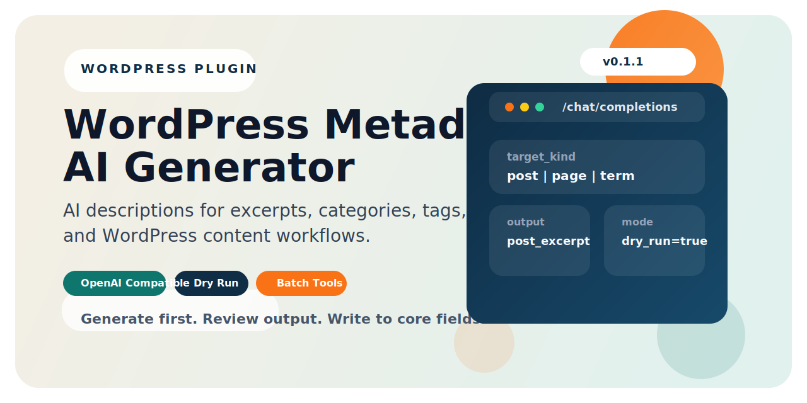

# WordPress Metadata AI Generator

[English](README.md) | [简体中文](README.zh-CN.md) | [繁體中文](README.zh-TW.md) | [日本語](README.ja.md)

  

  <strong>WordPress 管理画面から、より整理された抜粋と説明文を生成。</strong>

WordPress Metadata AI Generator は、OpenAI 互換 API を使って投稿の抜粋やタクソノミー説明文を生成する、管理画面専用のプラグインです。投稿やカテゴリごとに手作業で説明文を書く負担を減らしたいサイト運営者向けに設計されています。

## できること

- 投稿、固定ページ、管理画面で使えるカスタム投稿タイプ、カテゴリー、タグの description を生成
- 投稿系オブジェクトは WordPress 標準の `excerpt` フィールドへ書き込み
- カテゴリーとタグは WordPress 標準の `description` フィールドへ書き込み
- 編集画面からの個別実行と、管理画面からの一括実行に対応
- `Dry Run` モードで、保存前に生成結果を確認可能
- 設定読込、リクエスト開始、生成結果、保存、スキップ、失敗を記録する簡易ログを搭載

> 実際の公開運用を意識した設計です。設定後は管理画面から直接生成でき、必要に応じて Dry Run で確認してから WordPress 標準フィールドへ保存できます。

## 動作要件

- WordPress 6.0 以上
- PHP 7.4 以上
- OpenAI Chat Completions 互換の API エンドポイント

## インストール

1. プラグインフォルダを `wp-content/plugins/` にアップロードするか、管理画面から配布 ZIP をインストールします。
2. プラグインを有効化します。
3. `設定 > Metadata AI` を開きます。
4. API Base URL、API Key、モデル、プロンプトを入力します。
5. 設定を保存し、接続テストを実行します。

## 使い方

1. 管理画面で投稿、固定ページ、カテゴリー、またはタグを開きます。
2. 編集画面から生成を実行するか、`ツール > Metadata AI Batch` で一括生成します。
3. 生成結果を確認します。
4. `Dry Run` が無効なら、生成された説明文が WordPress の標準フィールドに書き込まれます。

## 現在の対象範囲

- このリリースは description 生成に限定しています。
- 投稿、固定ページ、管理画面で使えるカスタム投稿タイプ、カテゴリー、タグをサポートします。
- 画像 alt 生成、SEO プラグイン独自フィールド同期、非同期キューは含まれていません。
