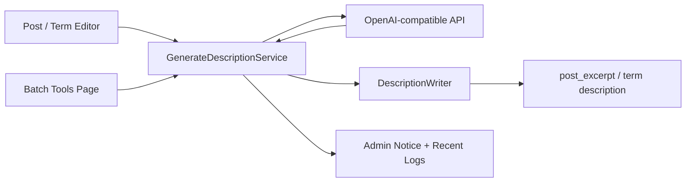

<p align="center">
  
</p>

<div align="center">

# WordPress Metadata AI Generator

一个轻量、稳妥、以后台编辑流程为中心的 WordPress 插件。  
通过 OpenAI 兼容 API，为文章摘要和分类描述生成可直接写回 WordPress 标准字段的内容。

<p>
  
  
  
  
  
</p>

</div>

## 项目定位

- 为 `post`、`page` 和已启用 UI 的自定义文章类型生成 `excerpt`
- 为 `category` 和 `post_tag` 生成原生 taxonomy `description`
- 只写回 WordPress 标准字段，不触碰 SEO 插件私有字段
- 支持 `Dry Run`、单项生成、批量扫描与同步批量执行
- 保持纯 PHP 后台实现，避免引入复杂队列或重型依赖

> 当前版本只做 description / excerpt 生成，不做 image alt、不做正文改写、不做 Yoast 等 SEO 插件私有字段同步。

## 功能亮点

| 模块 | 能力 |
| --- | --- |
| 单项生成 | 在文章、页面、CPT 编辑页侧栏生成摘要；在分类、标签编辑页生成描述 |
| 批量补全 | 扫描“描述为空”的对象，先预览，再对预览列表执行一轮批量生成 |
| OpenAI 兼容 | 使用标准 `/chat/completions` 接口，可接入兼容该协议的 API 服务 |
| 安全落库 | 文章写入 `post_excerpt`，分类/标签写入原生 `description` |
| Prompt 可配 | 文章类对象和术语类对象分别有独立 system prompt |
| 调试友好 | 后台显示近期日志；在 `WP_DEBUG` 或 `WMAIGEN_DEBUG` 下镜像到 PHP error log |

## 工作流



## 支持对象

| 对象 | 当前支持 | 写入字段 | 单项生成 | 批量扫描 |
| --- | --- | --- | --- | --- |
| 文章 | `post` | `post_excerpt` | 是 | 仅扫描摘要为空的对象 |
| 页面 | `page` | `post_excerpt` | 是 | 仅扫描摘要为空的对象 |
| 自定义文章类型 | 所有 `show_ui=true` 的非内建 CPT | `post_excerpt` | 是 | 仅扫描摘要为空的对象 |
| 分类 | `category` | term `description` | 是 | 仅扫描描述为空的对象 |
| 标签 | `post_tag` | term `description` | 是 | 仅扫描描述为空的对象 |

## 安装

1. 下载本仓库，或直接使用仓库中的 `dist/wordpress-metadata-aigen.zip`。
2. 将插件目录放到 `wp-content/plugins/wordpress-metadata-aigen`，或者在 WordPress 后台上传 ZIP。
3. 启用插件。
4. 打开 `设置 -> Metadata AI` 完成 API 配置。

## 配置说明

| 配置项 | 说明 |
| --- | --- |
| `Base URL` | 填 API 根路径，例如 `https://api.openai.com/v1`。插件会自动拼接 `/chat/completions` |
| `API Key` | 以 `Bearer` 形式发送到兼容接口 |
| `Model` | 使用的模型名 |
| `Timeout` | 请求超时，范围 `5-120` 秒 |
| `Dry Run` | 默认开启。开启时只生成预览和日志，不写入 WordPress 字段 |
| `System Prompt: Post / Page / CPT` | 控制文章类对象生成风格 |
| `System Prompt: Category / Tag` | 控制 taxonomy 描述生成风格 |

> 建议首次接入新模型或新供应商时，先保持 `Dry Run` 开启，确认输出风格和长度稳定后再落库。

## 使用方式

### 1. 单项生成

在文章、页面或自定义文章类型的编辑页，右侧会出现 `AI Description Generator` 面板：

- 点击 `Save and Generate Description`
- Gutenberg 编辑器下会先保存当前内容，再发起生成
- 如果当前已有摘要，可勾选 `Overwrite existing excerpt`
- `Dry Run` 开启时，生成结果只会显示在后台提示中，不会写入 `post_excerpt`

### 2. 分类 / 标签生成

在分类或标签编辑页，会追加一组生成控件：

- 点击 `Save and Generate Description`
- 如有现有描述，可勾选 `Overwrite existing description`
- 保存术语表单后触发生成

### 3. 批量生成

打开 `工具 -> Metadata AI Batch`：

1. 选择对象类型过滤器
2. 设置扫描上限，范围 `1-100`
3. 点击 `Scan Empty Descriptions`
4. 检查当前预览列表
5. 点击 `Run Batch Generation`

批量执行是同步完成的，且基于“最近一次扫描得到的预览列表”运行。它不会主动覆盖已有描述，只处理扫描时为空的对象。

### 4. 日志

设置页和批量页都会显示近期日志，包含：

- 时间
- 对象类型
- 对象 ID
- 名称
- 动作
- 结果
- 消息

日志最多保留 `200` 条，并存储在 WordPress option `wmaigen_logs` 中。

## 目录结构

```text
wordpress-metadata-aigen/
├── assets/
│   ├── js/
│   └── readme-hero.svg
├── dist/
├── scripts/
│   └── package-plugin.sh
├── src/
│   ├── Admin/
│   ├── Application/
│   ├── Domain/
│   ├── Infrastructure/
│   └── Support/
├── views/
├── wordpress-metadata-aigen.php
└── README.md
```

## 开发与打包

```bash
bash scripts/package-plugin.sh
```

执行后会得到：

- `dist/wordpress-metadata-aigen-0.1.1.zip`
- `dist/wordpress-metadata-aigen.zip`

## 当前边界

- 不支持自定义 taxonomy 的描述生成，当前仅支持 `category` 和 `post_tag`
- 不做异步队列、定时任务或后台 worker
- 不写入 Yoast、Rank Math 等 SEO 插件私有字段
- 不生成图片 `alt`、Open Graph、标题或正文
- 批量运行是单次同步流程，不带断点续跑或任务队列
